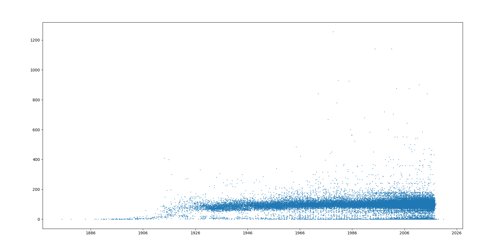

# Python Assignment 3 : Movies Dataset


## Assignment: Movies Dataset - https://github.com/MikkelHansen95/dataset

## Group
Foolish Supermarket - Alexander (cph-ah353), Stanislav (cph-sn186), Mathias B. (cph-mb493), Mikkel L. (cph-ml474)

## Project Deescription
This is a program written to interact with a specific dataset (see example below).

## How to run (from CLI)
In root of folder, in your terminal of choice, write:

```python main.py <url>```

### example:

```python main.py https://raw.githubusercontent.com/MikkelHansen95/dataset/master/movies_metadata.csv```

## Results

### tasks:
1) How many movie are rated adult? = 9

2) How many movies are listed as animation? = 1935

3) Which movie had the highest budget? = ('Pirates of the Caribbean: On Stranger Tides', '380000000')

4) Which danish movie is most popular? = ('The Lego Batman Movie', '17.070748000000002')

5) Which english action movie had the biggest revenue? = ('Avatar', '2787965087')


### plots:
6) Plot: histogram with number of movies according to release day for 'adult' and 'non adult' movies.


7) Plot: Scatter-Plot with runtime as y value and release date as x value.



8) Plot: 3D Scatter-Plot with the word frequency for each movie out of the 100 most used 'buzzwords' from all movies overviews (Firstly find 100 most used 'buzzwords' and then find the frequency of these words in each movies overview)


